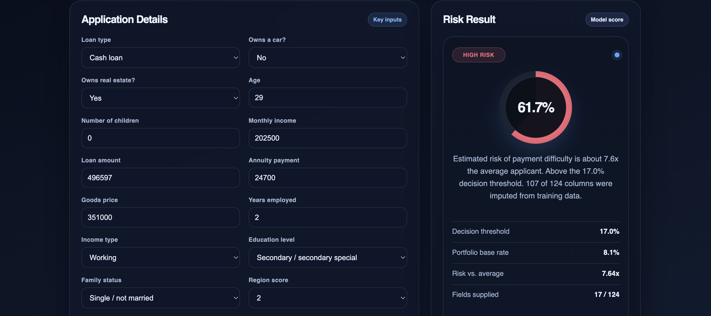

# Credit Risk Scoring Project


Estimating the probability that a loan applicant will experience payment
difficulties, using the public Home Credit application dataset — from
exploratory analysis through a calibrated model to a served scoring interface.

> **Scope:** this is a portfolio project, not a production credit decision
> system. See [Limitations](#limitations).

---

## Results

| | |
|---|---|
| Model | LightGBM (randomised search, 3-fold CV) + isotonic calibration |
| Test ROC-AUC | see `artifacts/model_config.json` → `test_metrics` |
| Test PR-AUC | reported against the 8.07% base rate |
| Brier score | reported against a constant-prediction baseline |
| Decision threshold | selected on a held-out validation split, not assumed to be 0.50 |

Exact figures are written into `artifacts/model_config.json` when the notebook
runs, so the numbers in this README and the numbers in the artifact can never
drift apart.

---

## Project structure

```text
credit-risk-project/
├── data/                                   # not in version control — see Setup
│   ├── application_train.csv
│   └── HomeCredit_columns_description.csv
├── artifacts/                              # generated by the notebook
│   ├── credit_risk_model.joblib
│   └── model_config.json
├── templates/
│   └── index.html
├── static/
│   ├── app.js
│   └── styles.css
├── credit_risk.ipynb  # the analysis
├── app.py                                  # FastAPI scoring service
├── requirements.txt
├── LICENSE
└── README.md
```

---

## Setup

### 1. Install dependencies

```bash
python -m venv .venv
source .venv/bin/activate          # Windows: .venv\Scripts\activate
pip install -r requirements.txt
```

### 2. Get the data

The dataset is not committed to this repository. Download it from the
[Home Credit Default Risk competition](https://www.kaggle.com/competitions/home-credit-default-risk/data)
on Kaggle and place two files in `data/`:

```bash
mkdir -p data
# from the competition download:
#   application_train.csv
#   HomeCredit_columns_description.csv
```

With the Kaggle CLI:

```bash
kaggle competitions download -c home-credit-default-risk -f application_train.csv -p data/
kaggle competitions download -c home-credit-default-risk -f HomeCredit_columns_description.csv -p data/
unzip -o 'data/*.zip' -d data/
```

### 3. Run the notebook

```bash
jupyter lab credit_risk.ipynb
```

Run it from the project root (so `data/` and `artifacts/` resolve) and use
**Kernel → Restart & Run All**. This writes `artifacts/credit_risk_model.joblib`
and `artifacts/model_config.json`.

Expect the randomised search to take several minutes on a laptop; it fits 12
parameter settings across 3 folds on ~246k rows.

### 4. Run the scoring service

```bash
uvicorn app:app --reload
```

Then open <http://127.0.0.1:8000>.

| Endpoint | Purpose |
|---|---|
| `GET /` | scoring form |
| `GET /health` | liveness plus loaded-model summary |
| `GET /metadata` | threshold, base rate, test metrics, library versions |
| `POST /predict` | JSON in, calibrated probability and risk band out |

```bash
curl -X POST http://127.0.0.1:8000/predict \
  -H 'Content-Type: application/json' \
  -d '{"AMT_INCOME_TOTAL": 150000, "AMT_CREDIT": 500000, "AMT_ANNUITY": 25000,
       "age_years": 35, "years_employed": 5,
       "EXT_SOURCE_2": 0.62, "EXT_SOURCE_3": 0.55}'
```

---

## Methodology

### Target imbalance

The positive class is about 8% of applications, so accuracy is not used as a
headline metric. ROC-AUC, PR-AUC (against the base rate), precision, recall,
F1 and Brier score are reported instead.

### `DAYS_EMPLOYED` anomaly

The known `365243` placeholder is converted into an explicit anomaly flag and
replaced with missing before modelling, so that roughly a thousand years of
employment is never read as a genuine numeric value. The flag lets the model
learn whether the missingness pattern itself is informative.

### `EXT_SOURCE` investigation

`EXT_SOURCE_1/2/3` are examined during EDA — missingness, distributions and
decile-wise default rates — before any modelling, rather than being discovered
only afterwards through SHAP.

### Leakage control

All preprocessing (median imputation for numeric, most-frequent plus one-hot
for categorical) lives inside a scikit-learn `Pipeline`, so it is fitted on
training folds only. Each model gets its **own** preprocessor instance via a
factory function, because `Pipeline` does not clone its steps — sharing one
`ColumnTransformer` across several pipelines silently re-fits the same object.

### Calibration, and why it is the centrepiece

The tuned model selects `class_weight="balanced"`, which improves the ranking
but inflates predicted scores well above the 8% base rate. That is harmless for
AUC and actively misleading the moment the number is shown to a user as a
percentage — an uncalibrated model here scores worse than *always predicting
the base rate* on Brier score.

The training set is therefore split three ways, each subset used for exactly
one job:

| Split | Share of train | Job |
|---|---|---|
| `X_fit` | 70% | fit LightGBM |
| `X_cal` | 15% | fit the isotonic calibrator |
| `X_val` | 15% | select the decision threshold |

The deployed artifact is the calibrated pipeline. The uncalibrated
full-training-set model is retained in the notebook as a comparison point and
as the object explained by SHAP — isotonic calibration is monotone, so it does
not change the ordering the explanations describe.

### Threshold as a business policy

The cutoff is treated as an explicit input rather than an unexamined `0.50`.
The notebook shows three things:

1. Class weighting and threshold tuning are two levers on the same mechanism.
   Stacking both pushes the "optimal" uncalibrated cutoff back toward `0.50`,
   which makes threshold work look pointless. On calibrated probabilities the
   optimum moves well below it.
2. The operating point is restated in business terms — what share of applicants
   is flagged, and what share of defaults is caught.
3. A cost-based cutoff is derived under a 10:1 false-negative-to-false-positive
   loss assumption and cross-checked against the analytical optimum
   `C_fp / (C_fp + C_fn)`.

The F1-optimal threshold is deployed; the alternatives are exported alongside
it in `model_config.json`.

### Fairness

`CODE_GENDER` is screened two ways: outcome disparity (flag rate and per-group
AUC at the deployed threshold) and marginal contribution (AUC with and without
the column). The served interface does not collect gender.

Note that dropping a protected attribute does not by itself make a model
even-handed, since other features can act as proxies. Proper treatment needs
fairness constraints and legal review, which are out of scope here.

### Training / serving parity

Four features are engineered *before* the pipeline runs:

| Feature | Definition |
|---|---|
| `CREDIT_INCOME_RATIO` | `AMT_CREDIT / AMT_INCOME_TOTAL` |
| `ANNUITY_INCOME_RATIO` | `AMT_ANNUITY / AMT_INCOME_TOTAL` |
| `CREDIT_ANNUITY_RATIO` | `AMT_CREDIT / AMT_ANNUITY` |
| `DAYS_EMPLOYED_ANOM` | `1` if `DAYS_EMPLOYED == 365243` else `0` |

These definitions are exported into `model_config.json` and re-applied by
`app.py`. This matters concretely: `CREDIT_ANNUITY_RATIO` is the model's single
highest-importance feature, and serving code that forgets to derive it sends
NaN and gets a prediction dominated by the imputed median.

### Honest reporting of missing input

The web form collects roughly 15 of 124 columns. Everything else is imputed
with a training statistic, which pulls any prediction toward an average
applicant. The API returns `features_supplied / total_columns` and the UI shows
it, rather than presenting a sparse form as a confident assessment.

---

## Limitations

- **Single table.** Only `application_train.csv` is used. The `bureau`,
  `previous_application`, `installments_payments`, `credit_card_balance` and
  `POS_CASH_balance` tables are out of scope. Aggregating them is the single
  largest available improvement to discrimination.
- **No out-of-time validation.** The split is random, not temporal, so
  population drift is not measured.
- **No reject inference.** The dataset only contains approved applicants, so
  the model learns from a censored population.
- **Fairness is screened, not solved.** No constraints are imposed and no
  proxy analysis is performed.
- **Not production-ready.** A deployed system would additionally require
  stability and drift monitoring, calibration monitoring, challenger models,
  documented model governance and regulatory review.

---

## License

MIT — see [LICENSE](LICENSE).

Dataset © Home Credit Group, used under the terms of the Kaggle competition.

---

## 🐳 Running with Docker

To run the application in an isolated environment without dependency issues:

```bash
docker build -t credit-risk-app .
docker run -p 8000:8000 credit-risk-app